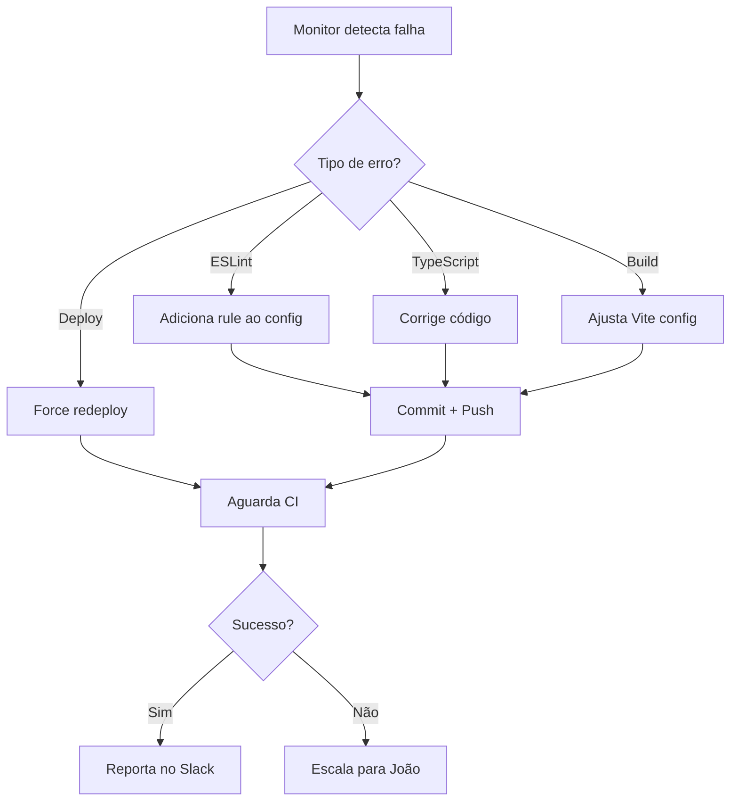

# CI/CD Monitoring - Esteira de Desenvolvimento

## Visão Geral

Sistema de monitoramento automatizado 24/7 da esteira de desenvolvimento, incluindo GitHub Actions, Vercel deploys e saúde de produção.

## Componentes

### 1. CI/Vercel Monitor (Cron)
- **Frequência:** A cada 15 minutos
- **ID:** `ci-vercel-monitor` (551d26ce-475b-4f92-a77a-77a361601dd7)
- **Modelo:** Sonnet (custo otimizado)
- **Timeout:** 10 minutos

**O que monitora:**
- ✅ GitHub Actions failures (últimos 30min)
- ✅ Vercel deployments (últimos 5)
- ✅ Production health check (HTTP 200)

**Auto-fix capabilities:**
- ESLint errors → adiciona rules ao `eslint.config.js`
- TypeScript errors → corrige código
- Vite build errors → ajusta `vite.config.ts`
- Vercel deployment → force redeploy
- GitHub workflows → corrige permissões/flags

### 2. Workflows Configurados

#### CI (`ci.yml`)
- Lint + TypeScript check
- Build validation
- Roda em todos os pushes

#### Preview Deploy (`preview.yml`)
- Deploy automático de preview para PRs
- Comenta no PR com URL
- **Permissões:** `pull-requests: write`

#### Production Deploy (`production.yml`)
- Deploy manual ou via merge para main
- Usa `--prod` flag
- Sem alias (direto para domínio principal)

#### Staging Deploy (`staging.yml`)
- Deploy para staging environment
- Usa comando em 2 etapas (deploy + alias)

### 3. Configurações Vercel

**Projeto:** `revenue-os` (prj_KyA6DxAwlqMkByFht8T7YEZPTCf9)

**Configuração:**
```json
{
  "framework": "vite",
  "buildCommand": "npm run build",
  "outputDirectory": "dist"
}
```

**Environment Variables (Production):**
- `VITE_SUPABASE_URL`
- `VITE_SUPABASE_PUBLISHABLE_KEY`

**SSO Protection:** Desabilitada (acesso público)

### 4. Vite Build Config

**Configuração otimizada** (`vite.config.ts`):
- Chunking básico (vendor-react, vendor-ui, vendor-query)
- Sem granularidade excessiva (evita empty chunks)
- Target: esnext
- CSS code split habilitado

## Problemas Comuns Resolvidos

### Empty Chunks (09/02/2026)
**Causa:** `manualChunks` function muito granular
**Solução:** Simplificado para objeto com 3 chunks básicos
**Commit:** `6d941069`

### Preview Deploy Permission (09/02/2026)
**Causa:** Faltava `pull-requests: write` permission
**Solução:** Adicionado no workflow
**Commit:** `0b11c613`

### Vercel Alias Flag Obsoleta (09/02/2026)
**Causa:** Flag `--alias` removida no Vercel CLI v50
**Solução:** Comando em 2 etapas (deploy → alias set)
**Commit:** `161e5b92`

## Fluxo de Auto-Correção



## Métricas Monitoradas

- **CI Pass Rate:** % de builds passando
- **Deploy Success Rate:** % de deploys bem-sucedidos
- **Production Uptime:** HTTP 200 no health check
- **Auto-fix Rate:** % de problemas resolvidos automaticamente

## Alertas

**Para Slack (#crew-dev):**
- Correções automáticas bem-sucedidas
- Deploys realizados
- Métricas normais

**Para João (Telegram):**
- Falhas que não conseguiu corrigir
- Production down
- 3+ falhas consecutivas
- Problemas de segurança

## Comandos Úteis

```bash
# Listar falhas recentes
gh run list --repo juboyy/revenue-OS --status failure --limit 5

# Ver logs de uma run
gh run view <id> --log-failed

# Listar deploys Vercel
curl -H "Authorization: Bearer $VERCEL_TOKEN" \
  "https://api.vercel.com/v9/deployments?projectId=prj_KyA6DxAwlqMkByFht8T7YEZPTCf9&limit=5"

# Health check production
curl -sI https://revenue-os-sand.vercel.app/

# Force redeploy
cd /home/ubuntu/.openclaw/workspace/revenue-OS
npx vercel deploy --prod --yes --token $VERCEL_TOKEN
```

## Próximos Passos

- [ ] Integrar monitoring de Supabase Edge Functions
- [ ] Adicionar alertas proativos (antes de falhar)
- [ ] Dashboard de métricas da esteira
- [ ] Rollback automático se deploy quebrar production
- [ ] Performance monitoring (lighthouse scores)

---

**Última atualização:** 09/02/2026 22:25 UTC
**Responsável:** Imu 🌀
